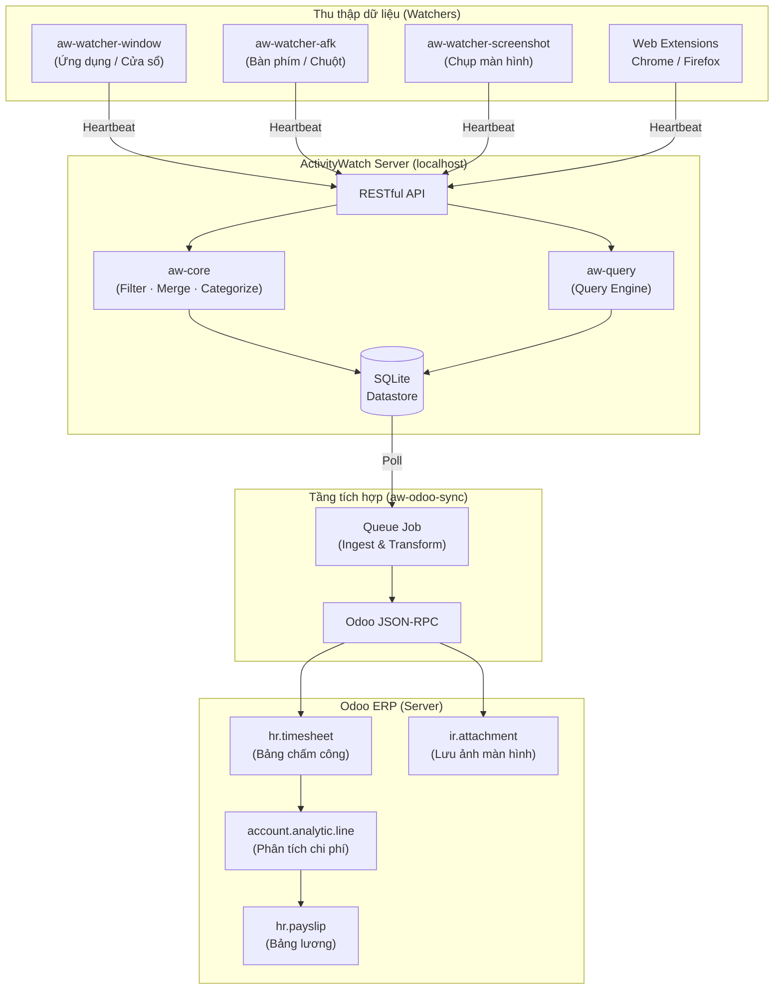
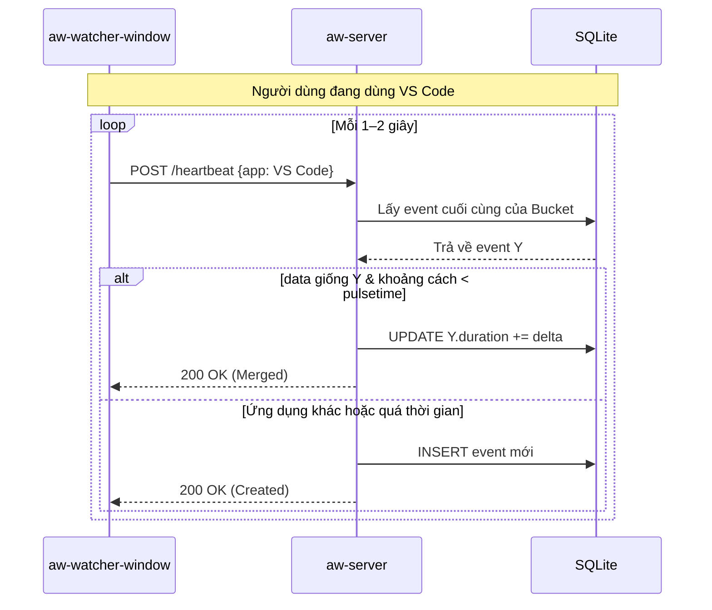
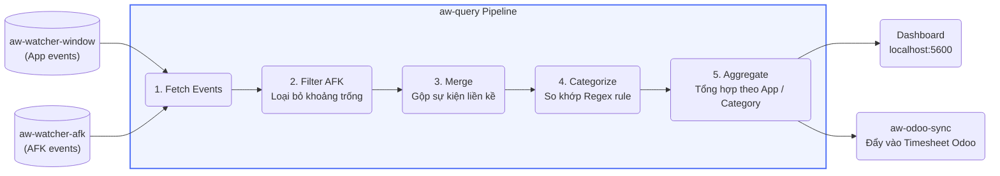
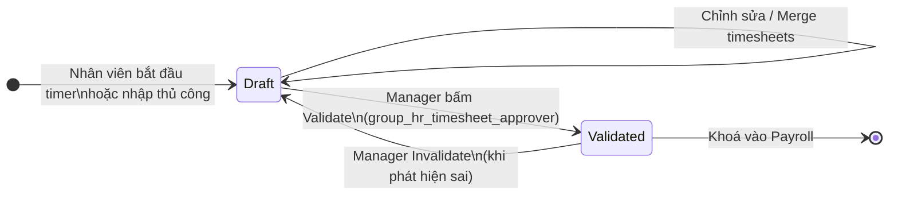
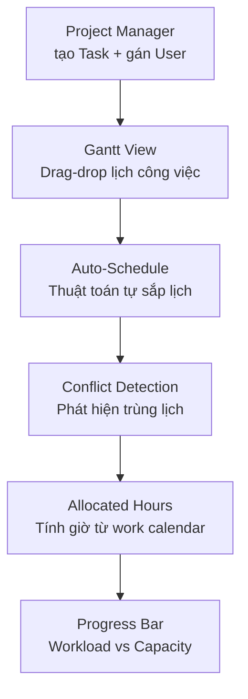
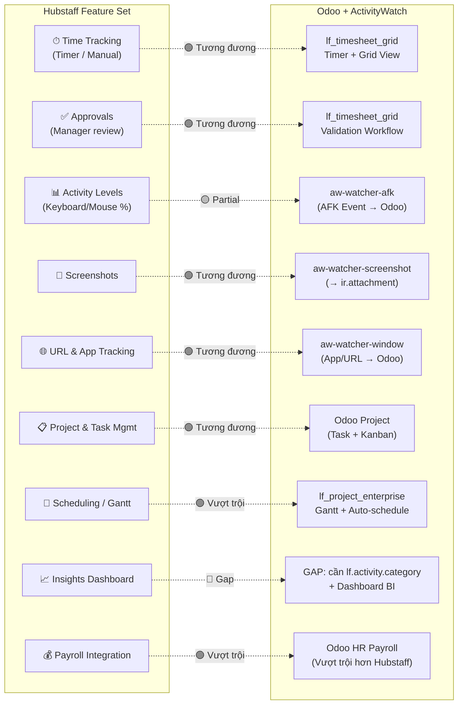
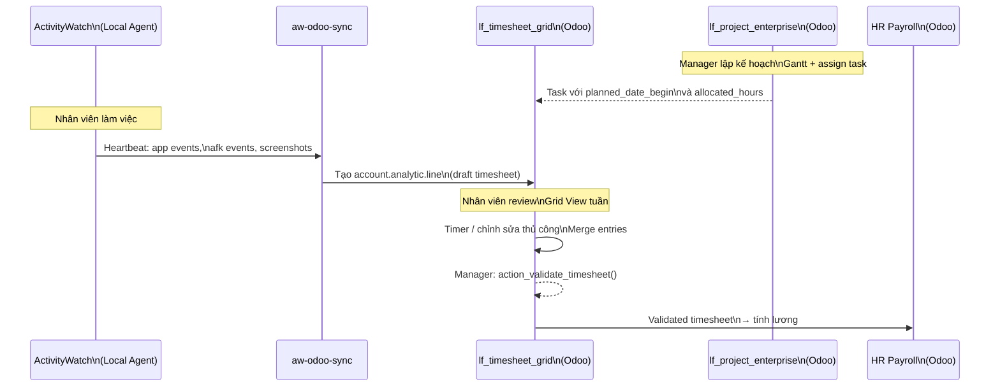

# ActivityWatch × Odoo

---

## Tóm tắt(Executive Summary)

| | Hubstaff Enterprise ($25/user/tháng) | **ActivityWatch × Odoo (Self-hosted)** |
|---|---|---|
| **Chi phí** | ~$25/user/tháng, tăng theo đầu người | Phí server cố định, không tính theo đầu người |
| **Quyền sở hữu dữ liệu** | Dữ liệu lưu trên cloud của Hubstaff | **100% on-premise**, không rời khỏi máy công ty |
| **Tích hợp ERP** | Hạn chế (Jira, Asana via Zapier) | **Tích hợp gốc** với Odoo: Payroll, Project, Timesheet, Invoice |
| **Tùy biến** | Black-box, không sửa được | **Mã nguồn mở**, tùy biến hoàn toàn |
| **Lưu trữ lịch sử** | Add-on trả phí | Tùy ý, chi phí chỉ là ổ cứng |

**Kết luận sơ bộ:** Với đội ngũ văn phòng/IT thuần túy, tổ hợp ActivityWatch × Odoo có thể thay thế Hubstaff Enterprise với chi phí thấp hơn đáng kể, đồng thời cung cấp nền tảng ERP đầy đủ mà Hubstaff không có.

---

## 1. Kiến trúc Hệ thống ActivityWatch

ActivityWatch được xây dựng theo mô hình **Local Client-Server**: toàn bộ dữ liệu thu thập, xử lý, và lưu trữ đều nằm trên máy người dùng — không có gì gửi lên cloud của bên thứ ba.

### Các thành phần chính

| Thành phần | Vai trò |
|---|---|
| **Watchers** | Thu thập dữ liệu từ OS (cửa sổ đang dùng, trạng thái bàn phím/chuột, ảnh màn hình, URL trình duyệt...) |
| **aw-server** | API Hub trung tâm, nhận heartbeat từ Watchers, lưu vào SQLite |
| **aw-core** | Thư viện xử lý: merge sự kiện, lọc AFK, phân loại theo regex |
| **aw-webui** | Dashboard Vue.js để xem báo cáo thời gian thực trên `localhost:5600` |
| **aw-qt / aw-tauri** | Tray icon — quản lý vòng đời toàn bộ hệ thống |

### Sơ đồ Kiến trúc Tổng quan



---

## 2. Mô hình Dữ liệu

### Bucket — Luồng dữ liệu

Mỗi Watcher trên mỗi thiết bị tạo ra một **Bucket** riêng biệt, được định danh theo quy ước:

```
{watcher-name}_{hostname}
Ví dụ: aw-watcher-window_DESKTOP-ACME01
```

### Event — Đơn vị dữ liệu cơ bản

```json
{
  "timestamp": "2026-05-05T09:00:00+07:00",
  "duration": 47.5,
  "data": {
    "app": "Code.exe",
    "title": "architecture.md — activitywatch [VS Code]"
  }
}
```

---

## 3. Cơ chế Heartbeat & Event Merging

Thay vì ghi một sự kiện mỗi giây (tốn storage), Watchers dùng cơ chế **Heartbeat**: ping liên tục sự kiện *hiện tại* lên server, và server tự gộp nếu đủ điều kiện.



**Kết quả thực tế:** 8 tiếng làm việc chỉ sinh ra vài trăm event, thay vì ~28.800 event nếu ghi mỗi giây.

---

## 4. Pipeline Truy vấn & Tổng hợp

Dữ liệu thô từ nhiều Watcher cần được **làm sạch và kết hợp** trước khi hiển thị báo cáo:



---

## 5. Quản lý & Triển khai (System Shell)

- **`aw-qt` / `aw-tauri`**: Chạy tray icon, đóng vai trò **Parent Process** — tự động khởi động `aw-server`, `aw-watcher-window`, `aw-watcher-afk` khi người dùng đăng nhập Windows/Mac.
- **`aw-odoo-sync`**: Tiến trình nền riêng biệt, đọc dữ liệu từ `aw-server` (localhost:5600) và đẩy lên Odoo qua Queue Job. Hoạt động **silent** — người dùng không cần tương tác.
- Toàn bộ stack có thể cài thành **Windows Service** hoặc **launchd plist (Mac)** để auto-start khi bật máy, không cần user thao tác.

---

## 6. Đánh giá Fit-Gap so với Hubstaff Enterprise

### Tổng quan nhanh

```
🟢 FIT (Đáp ứng tốt / Vượt trội)   ████████████████░░░░  ~80%
🟡 GAP nhỏ (Cần code thêm ~1-2 sprint)  ████░░░░░░░░░░░░  ~20%
```

---

### 🟢 FIT — Đáp ứng tốt hoặc Vượt trội

#### Time Tracking & Activity Monitoring
- **Hubstaff:** Ghi nhận app/URL sử dụng, tính giờ làm việc theo task.
- **AW × Odoo:** Tương đương. `aw-watcher-window` + `aw-watcher-afk` → `aw-odoo-sync` → `hr.timesheet` trên Odoo. Độ chính xác ngang bằng, tùy biến cao hơn.

#### Screenshots
- **Hubstaff:** Chụp định kỳ, lưu trên cloud Hubstaff.
- **AW × Odoo:** `aw-watcher-screenshot` chụp, `aw-odoo-sync` đẩy lên `ir.attachment` trong Odoo. **Ưu điểm:** Ảnh không rời khỏi hạ tầng công ty.

#### Silent / Background Operation
- **Hubstaff Enterprise:** Cung cấp add-on "Silent App" chạy nền, không có giao diện.
- **AW × Odoo:** `aw-odoo-sync` được thiết kế theo mô hình silent client-server. Cơ chế `is_working` do Odoo Server quyết định — tray icon có thể ẩn hoàn toàn theo policy công ty.

#### Quản trị tổ chức (Tasks / Payroll / Time Off / Invoice)
- **Hubstaff:** Có module nội bộ nhưng rời rạc, không phải ERP.
- **AW × Odoo:** **Vượt trội.** Odoo là ERP đầy đủ — Timesheet → Payroll → Invoice → Time Off liên kết chặt chẽ trong một hệ thống duy nhất.

#### Data Retention
- **Hubstaff:** Giới hạn lịch sử, mua thêm add-on để giữ lâu hơn.
- **AW × Odoo:** Lưu trong PostgreSQL self-hosted. Giữ 6 năm hay 10 năm hoàn toàn tùy ý — chi phí chỉ là ổ cứng.

---

### 🟡 GAP nhỏ — Cần phát triển thêm

#### GAP 1: Smart Idle Timeout / Auto-discard AFK
- **Hubstaff:** Tự động trừ khoảng thời gian idle ra khỏi timesheet, có threshold tùy chỉnh.
- **Gap hiện tại:** `aw-watcher-afk` ghi nhận trạng thái `afk` đầy đủ, nhưng `aw-odoo-sync` chưa tự động trừ ngược thời gian AFK vào `account.analytic.line`.
- **Giải pháp:** Thêm logic trong Ingest Job: khi phát hiện chuỗi event `afk` dài hơn X phút, tự động bóc tách và giảm duration tương ứng trên timesheet trước khi ghi.


#### GAP 2: Productivity Analytics & Insights Dashboard
- **Hubstaff:** Dashboard phân loại sẵn "Productive / Unproductive / Neutral" với leaderboard team.
- **Gap hiện tại:** AW local có regex categorization, nhưng Odoo chưa có BI view hiển thị tỉ lệ năng suất.
- **Giải pháp:** Tạo model `lf.activity.category` trên Odoo + Pivot/Dashboard view để vẽ biểu đồ. Tận dụng dữ liệu category đã được AW xử lý sẵn trước khi sync.


#### GAP 3: Auto Start/Stop Tracking Policy
- **Hubstaff Enterprise:** Tự động bắt đầu tính giờ khi bật máy theo company policy, không cần user bấm Play.
- **Gap hiện tại:** Flow hiện tại vẫn yêu cầu user bấm Play thủ công trên Odoo Web.
- **Giải pháp:** Thêm checkbox trong Odoo Company Settings: `[x] Auto-start timesheet when device is online`. Khi nhận được heartbeat đầu tiên trong ngày từ thiết bị, Odoo tự tìm task mặc định và bật `is_timer_running = True`.

---

## 7. Odoo Modules Deep-dive: `lf_timesheet_grid` & `lf_project_enterprise`

Đây là hai module Odoo cốt lõi tạo nên "bộ não" quản lý công việc và thời gian trong hệ thống. Hiểu rõ chức năng của chúng giúp đánh giá chính xác hơn mức độ thay thế Hubstaff.

---

### 7.1 Giới thiệu Chức năng

#### `lf_timesheet_grid` — Module Chấm Công & Phê duyệt

Module này quản lý toàn bộ vòng đời của một bản ghi thời gian làm việc: từ lúc nhân viên bấm Start → ghi nhận giờ → nộp phê duyệt → quản lý xác nhận → tính lương.



**Tính năng chính:**

| Tính năng | Chi tiết kỹ thuật |
|---|---|
| **Timer tích hợp Task** | Start/Stop ngay trên task card → tự tạo `account.analytic.line` với `unit_amount` được làm tròn theo `timesheet_rounding` (mặc định 15 phút) |
| **Grid View tuần** | Xem/nhập toàn bộ giờ làm trong tuần dạng bảng — tương tự Google Sheets timesheet |
| **Workflow phê duyệt** | 3 cấp: `user` (nhập) → `approver` (validate) → `manager` (toàn quyền). Timesheet đã validate là **readonly** với user thường |
| **Merge Timesheets** | Gộp nhiều dòng cùng task/project vào một dòng duy nhất qua wizard |
| **Nhắc nhở tự động** | 2 cronjob email: (1) nhắc nhân viên nộp timesheet, (2) nhắc manager phê duyệt — cấu hình được tần suất và delay |
| **Hiển thị khả dụng** | Grid tô màu ngày nghỉ/ngày lễ từ `resource.calendar` (work schedule) của nhân viên |
| **Timesheet Manager** | Mỗi nhân viên có `timesheet_manager_id` riêng — tách biệt khỏi line manager HR |

---

#### `lf_project_enterprise` — Module Lập Kế hoạch & Phân bổ Nguồn lực

Module này giải quyết bài toán "ai làm gì, từ khi nào đến khi nào, có đủ thời gian không" — chức năng mà Hubstaff hoàn toàn không có.



**Tính năng chính:**

| Tính năng | Chi tiết kỹ thuật |
|---|---|
| **Gantt View** | Drag-drop `planned_date_begin` / `date_deadline` trực tiếp trên biểu đồ; constraint SQL: `begin ≤ deadline` |
| **Auto-scheduling** | Thuật toán `schedule_tasks()` tự sắp lịch dựa trên: dependency chain, work calendar user, workload hiện tại |
| **Conflict Detection** | `planning_overlap`: SQL query phát hiện task cùng user chồng lấn thời gian → cảnh báo trực tiếp trên form/gantt |
| **Dependency Warning** | `dependency_warning`: Cảnh báo nếu task phụ thuộc chưa xong mà task hiện tại đã bắt đầu |
| **Allocated Hours** | `_compute_allocated_hours()`: tính giờ làm việc thực tế từ khoảng `planned_date_begin → date_deadline` theo work calendar (trừ ngày nghỉ) |
| **Progress Bar** | Hiển thị % workload của từng user trên Gantt — dựa trên tổng giờ được giao vs capacity từ resource calendar |
| **Multi-user Task** | Một task có thể assign nhiều `user_ids`; allocated hours tính tổng cho cả nhóm |
| **Map View** | Hiển thị task theo địa điểm (dùng `lf_web_map`) |

---

### 7.2 Điểm Giống nhau

Cả hai module đều:

1. **Chia sẻ nền tảng `project.task`** — `lf_project_enterprise` lo phần *lập kế hoạch* task (khi nào làm), `lf_timesheet_grid` lo phần *ghi nhận thực tế* (làm được bao nhiêu). Hai module bổ trợ nhau chứ không cạnh tranh.

2. **Tích hợp `resource.calendar`** — cả hai đều đọc lịch làm việc của nhân viên để hiển thị ngày nghỉ/không khả dụng: Gantt tô màu ngày lễ, Grid tô màu ô không làm việc.

3. **Đo lường theo giờ** — đơn vị chung là `Float` giờ (`unit_amount` / `allocated_hours`) tính qua UOM Odoo; cả hai đều hỗ trợ hiển thị `hh:mm` hoặc số thập phân.

4. **Security groups chung** — dùng `hr_timesheet.group_hr_timesheet_approver` và `group_timesheet_manager` từ module gốc; không tự định nghĩa group riêng.

---

### 7.3 Điểm Khác nhau

| Tiêu chí | `lf_timesheet_grid` | `lf_project_enterprise` |
|---|---|---|
| **Câu hỏi trả lời** | "Tôi đã làm gì và mất bao lâu?" | "Tôi nên làm gì vào lúc nào?" |
| **Dữ liệu cốt lõi** | `account.analytic.line` (thực tế) | `project.task` (kế hoạch) |
| **Chiều thời gian** | Thời gian *đã qua* (past) | Thời gian *tương lai* (future) |
| **Người dùng chính** | Nhân viên + Manager phê duyệt | Project Manager + Resource Planner |
| **View chủ đạo** | Grid (tuần), List, Kanban | Gantt, Calendar, Map |
| **Automation** | Cronjob nhắc nhở email, làm tròn giờ | Auto-schedule, conflict resolution |
| **Output** | Dữ liệu cho Payroll / Invoice | Kế hoạch cho Team Capacity |
| **Tương tác AW** | **Nhận dữ liệu từ AW** (sync timesheet) | Độc lập với AW |

---

### 7.4 Fit-Gap chi tiết với Hubstaff



**Phân tích từng điểm:**

#### 🟢 Time Tracking: `lf_timesheet_grid` vs Hubstaff Timer

| | Hubstaff | `lf_timesheet_grid` |
|---|---|---|
| Bắt đầu/Dừng timer | ✅ | ✅ (tích hợp ngay trong task card) |
| Nhập thủ công | ✅ | ✅ (Grid View tuần) |
| Làm tròn giờ | ✅ (custom) | ✅ (`timesheet_rounding`, mặc định 15 phút) |
| Thời gian tối thiểu | ✅ | ✅ (`timesheet_min_duration`, mặc định 15 phút) |
| Gộp entries | ❌ | ✅ (Merge Timesheets wizard) |
| **Ưu điểm Odoo** | — | Timer gắn trực tiếp vào Odoo Project Task, không cần tool riêng |

#### 🟢 Approvals: `lf_timesheet_grid` vs Hubstaff

| | Hubstaff | `lf_timesheet_grid` |
|---|---|---|
| Workflow phê duyệt | ✅ Manager approve | ✅ `draft → validated` |
| Nhắc nhở tự động | ✅ | ✅ (2 cronjob: nhân viên + manager) |
| Phê duyệt hàng loạt | ✅ | ✅ (chọn nhiều dòng → Validate) |
| Khóa sau phê duyệt | ✅ | ✅ (validated = readonly với user) |
| **Ưu điểm Odoo** | — | Timesheet đã validate → tự động feed vào Payroll Odoo |

#### 🟡 Activity Levels: AFK Watcher vs Hubstaff

| | Hubstaff | ActivityWatch + Odoo |
|---|---|---|
| % hoạt động bàn phím/chuột | ✅ (0–100%) | 🟡 Có data (AFK events), **chưa tính %** |
| Hiển thị trên timesheet | ✅ | 🟡 Chưa có — cần thêm field `activity_level` vào `account.analytic.line` |
| Threshold tùy chỉnh | ✅ | 🟡 Có thể config trong `aw-watcher-afk` (pulsetime) |
| **Lưu ý** | — | Raw data đã có, cần ~3 ngày để tính toán và hiển thị % |

#### 🟢 Gantt & Scheduling: `lf_project_enterprise` vs Hubstaff

Đây là điểm **Odoo vượt trội rõ ràng nhất** — Hubstaff không có tính năng này.

| | Hubstaff | `lf_project_enterprise` |
|---|---|---|
| Gantt view | ❌ Không có | ✅ Drag-drop đầy đủ |
| Auto-scheduling | ❌ | ✅ Thuật toán tự sắp dựa trên dependencies + calendar |
| Conflict detection | ❌ | ✅ Cảnh báo trùng lịch ngay trên Gantt/Form |
| Resource capacity | ❌ | ✅ Progress bar workload vs capacity |
| Task dependencies | ❌ | ✅ Dependency chain với cảnh báo vi phạm |

#### 🔴 Insights Dashboard: GAP

| | Hubstaff | Odoo hiện tại |
|---|---|---|
| Phân loại Productive/Unproductive | ✅ | ❌ Chưa có |
| Leaderboard team | ✅ | ❌ Chưa có |
| Top apps by time | ✅ | 🟡 Data có (AW window events), chưa có view Odoo |
| Trend charts | ✅ | 🟡 Có thể dùng Odoo Pivot/Graph nhưng chưa setup |
| **Giải pháp** | — | Tạo `lf.activity.category` model + Dashboard BI view ~1 sprint |

---

### 7.5 Sơ đồ Luồng Tổng hợp: AW × `lf_timesheet_grid` × `lf_project_enterprise`



---
